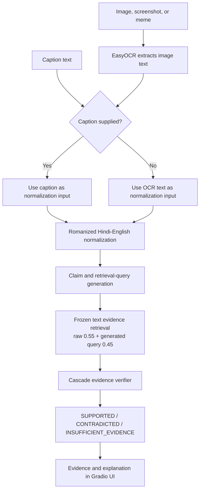

# VerifyHinglish

Interactive, evidence-grounded verification for Romanized Hindi-English code-switched social-media content.

VerifyHinglish was prepared for the ACM Multimedia Asia 2026 Demo Track. The submitted production build is commit [`09cf2af4003bdd74d273550a50febf9598f9f8b2`](https://github.com/nidhi-00/acm-multimedia/tree/09cf2af4003bdd74d273550a50febf9598f9f8b2), identified by the Git tag `mmasia-2026-submitted-build`. Later documentation or demo-asset commits do not redefine the submitted build.

## Overview

Claims shared on Indian social media often mix Romanized Hindi and English, and the claim-bearing text may appear inside a meme, screenshot, or news card. VerifyHinglish accepts captions and images, extracts embedded image text with OCR, normalizes the code-switched input, and produces an explicit factual claim and English retrieval query. It then retrieves evidence from a frozen text corpus and returns one of three evidence-grounded verdicts:

- `SUPPORTED`
- `CONTRADICTED`
- `INSUFFICIENT_EVIDENCE`

The Gradio interface keeps the interpreted claim, retrieved sources, verdict, and explanation together. The current language target is Romanized Hindi + English. Broader Devanagari support is future work.

Current image processing is OCR-based. OpenCLIP and visual-semantic image matching do not affect the final V7 production ranking.

## Implemented system

The repository integrates the following frozen production stages:

- English-only EasyOCR extraction of claim-bearing text from images, screenshots, memes, and news cards
- Qwen-based Romanized Hindi-English normalization and explicit factual claim extraction
- generation of a short English retrieval query
- exact text retrieval over a frozen corpus of 439 evidence records and the 424-document V7 candidate set
- score fusion between the raw input and generated retrieval query
- conservative three-way verification with an abstention outcome
- a Gradio interface for entering content and reviewing evidence
- deterministic prepared examples for offline interface demonstrations
- committed evaluation outputs, parser parity tests, environment records, and Slurm smoke jobs

The system does not perform unrestricted web search, live crawling, image-image matching, or visual-semantic ranking.

## Architecture



When both an image and caption are supplied, OCR still preserves the image text separately, but the caption is the normalization and raw-retrieval input. Caption and OCR text are not concatenated.

## Reproducible demo examples

The following images are available in [`demo_assets/query_images/`](demo_assets/query_images/). These are known observations from the frozen real pipeline, not guarantees about arbitrary new social-media content.

| Case | Input mode | Observed real result | Claim and evidence note |
| --- | --- | --- | --- |
| [`hmx-0224`](demo_assets/query_images/hmx-0224.png) | Image only | `SUPPORTED`, confidence 1.0 | Claim: "IQ of Krish Arora is 162, which is higher than that of Einstein and Hawking." Top evidence is an Economic Times article about Krish Arora. A lower-ranked document with an empty title is skipped in the public evidence list instead of being shown with fabricated metadata. |
| [`hmx-0611`](demo_assets/query_images/hmx-0611.png) | Image + caption | `CONTRADICTED`, confidence 1.0 | The cascade evaluated three documents and selected rank 3. This is not a reliable image-only case. |
| [`hmx-0000`](demo_assets/query_images/hmx-0000.png) | Image only | `INSUFFICIENT_EVIDENCE` | The claim concerns a secret chamber in the Jagannath Puri temple Ratna Bhandar. This case demonstrates conservative abstention. |
| [`hmx-0222`](demo_assets/query_images/hmx-0222.png) | Image only | `SUPPORTED`, confidence 1.0 | Claim: "Netflix has launched its own popcorn range for binge-watching." |

Use this exact caption with `hmx-0611`:

```text
AJ THACKERAY EFFECT IN PARIS......Paris mein, jab Muslims road par namaz padhte hain aur sadak block karte hain, tab unhe French citizens dwara French National Anthem ke zor se gaane ke saath jawab milta hai...
```

## Running the app

### Prepared offline UI

Prepared mode is the simplest way to review the interface. It needs Python 3.11 and the base project dependencies, but not the OCR or model stack.

```bash
python3.11 -m venv .venv
source .venv/bin/activate
python -m pip install -e ".[dev]"
VERIFYHINGLISH_BACKEND=mock python -m demo.app
```

`mock` is also the default backend when `VERIFYHINGLISH_BACKEND` is unset. The prepared UI scenarios span `SUPPORTED`, `CONTRADICTED`, and `INSUFFICIENT_EVIDENCE`, with an additional no-matching-evidence variant. Their analysis, evidence, and verdicts are fixed. They do not run EasyOCR, Qwen, MiniLM, or the live verifier, and they should not be interpreted as live model inference.

The app serves the overview at `/` and the verification workspace at `/verify`.

### Real frozen pipeline

The real mode was demonstrated in a provisioned GPU environment with cached model weights. Its validated deployment stack was:

| Component | Version or identifier |
| --- | --- |
| Python | 3.11.9 |
| Gradio | 6.17.3 |
| EasyOCR | 1.7.2 |
| Qwen | `Qwen/Qwen2.5-3B-Instruct` |
| Transformers | 4.57.6 |
| SentenceTransformers | 3.4.1 |
| Hugging Face Hub | 0.36.2 |
| PyTorch | 2.6.0+cu118 |
| torchvision | 0.21.0+cu118 |
| CUDA build | 11.8 |

Validated GPUs included the NVIDIA RTX 2080 Ti and NVIDIA GTX 1080 Ti. This does not imply that an arbitrary laptop can run the real stack.

From an already provisioned environment, launch the application with:

```bash
VERIFYHINGLISH_BACKEND=real python -m demo.app
```

The generic `real` extra declares the Python packages used by the pipeline, but it is not a complete GPU provisioning recipe. In particular, the compatible CUDA 11.8 PyTorch and torchvision wheels must come from the matching PyTorch wheel index, and the Qwen, MiniLM, and EasyOCR weights must be available. The reproducible Ada setup and validation flow is recorded in [`vh_v7_three_class_smoke.sbatch`](research/handoff/experiments/vh_v7_three_class_smoke.sbatch). The no-install image diagnostic is recorded in [`vh_final_five_image_smoke.sbatch`](research/handoff/experiments/vh_final_five_image_smoke.sbatch).

## Supported input behavior

- Caption or text input is supported.
- The workspace accepts uploaded PNG and JPEG images.
- Image-only requests run EasyOCR and use its output as the normalization input.
- If `post_text` is present, it takes precedence over OCR for normalization and raw retrieval.
- OCR output remains available separately in the analysis.
- The current target is predominantly Latin-script Romanized Hindi + English.

The real backend lazily loads and reuses EasyOCR, one shared Qwen model and tokenizer for normalization and verification, and one multilingual MiniLM encoder for retrieval.

## Frozen retrieval and verification

The production retriever uses `sentence-transformers/paraphrase-multilingual-MiniLM-L12-v2`. Query and evidence embeddings are normalized, so the implementation ranks by exact matrix-product similarity. For each candidate document:

```text
fused_text_score = 0.55 * raw_text_similarity
                 + 0.45 * generated_query_similarity
```

The verifier uses the frozen `cascade_top1_then_next2` strategy. It first checks the highest-ranked document. If that result is not decisive, it checks ranks 2 and 3 and selects the decisive tail result with the higher confidence. If the evidence does not establish support or contradiction, the verifier returns `INSUFFICIENT_EVIDENCE`.

## Evaluation snapshot

### HISTORICAL FROZEN V7 TEXT-INPUT BENCHMARK

The committed V7 final test artifact contains 60 queries: 46 labeled `SUPPORTED` and 14 labeled `CONTRADICTED`. These predictions used the frozen committed text input. They were not produced by replaying live OCR and must not be interpreted as image-only end-to-end accuracy.

| Metric | Value |
| --- | ---: |
| Fused retrieval R@1 | 0.6667 |
| Fused retrieval R@5 | 0.7667 |
| Fused retrieval R@10 | 0.7667 |
| Verifier strict accuracy | 0.3833 |
| Verifier coverage | 0.5000 |
| Verifier covered accuracy | 0.7667 |
| Verifier macro-F1 | 0.4280 |

The source is [`outputs/final/v7_final_metrics.json`](outputs/final/v7_final_metrics.json). Retrieval fusion and the cascade strategy were selected on V7 DEV before the frozen V7 final test.

The separate manually reviewed OCR benchmark contains 120 images, with 116 included after exclusions. Of those, 114 are Latin/Romanized and 2 are mixed Devanagari/Latin. For the English-only EasyOCR configuration, macro mean CER is 0.5334 and macro mean WER is 0.7537. These are OCR transcription metrics on that reviewed benchmark, not full-pipeline verdict metrics. See [`outputs/ocr/ocr_gold_eval_metrics.json`](outputs/ocr/ocr_gold_eval_metrics.json).

## Robustness behavior

- A malformed structured Qwen normalization is rejected. Downstream fields are withheld and the backend safely returns `INSUFFICIENT_EVIDENCE` with a warning.
- A candidate with missing required public metadata, such as an empty title, remains in the internal verifier ranking but is skipped in the public evidence list. Its rank is not reassigned and no title is fabricated.
- Verifier generation or parser failures produce a safe abstention rather than a fabricated supported or contradicted decision.
- `visual_description`, `image_score`, and `combined_score` remain unset in the real V7 pipeline.

These safeguards limit unsafe output, but they do not correct OCR or normalization errors.

## Repository structure

```text
src/demo/          Gradio app, backends, contracts, UI, and production pipeline
data/              Frozen evidence corpus and processed query artifacts
outputs/           Frozen embeddings, predictions, and evaluation metrics
research/handoff/  Authoritative environment, experiment, and smoke-test records
tests/             Contract, pipeline, UI, and frozen-artifact parity tests
demo_assets/       Selected query images for reproducible demonstrations
```

Run the local test suite with:

```bash
python -B -m pytest -p no:cacheprovider
```

Normal tests use injected fakes and do not download or load Qwen.

## Limitations

- English-only OCR is aimed mainly at Latin-script and Romanized Hinglish. Broader Devanagari handling remains future work.
- The final V7 ranker is text-only. OpenCLIP and visual-semantic similarity do not affect production ranking.
- Retrieval operates over a frozen evidence corpus, not unrestricted live web search.
- OCR and Qwen normalization errors can propagate to retrieval and verification.
- A suitable provisioned GPU runtime and cached model weights are required for the real model stack.
- Prepared examples are fixed fallback demonstrations, not live inference.
- A verdict is evidence-grounded assistance, not an authoritative fact-check.

## Reproducibility and submission status

The exact ACM Multimedia Asia 2026 submitted production build is:

```text
09cf2af4003bdd74d273550a50febf9598f9f8b2
```

Its Git tag is:

```text
mmasia-2026-submitted-build
```

[`research/handoff/`](research/handoff/) contains the frozen V7 behavior summary, experiment scripts, environment records, and GPU smoke jobs. The repository contains the implementation prepared for the ACM Multimedia Asia 2026 Demo Track. No publication, acceptance, or award status is claimed here.
